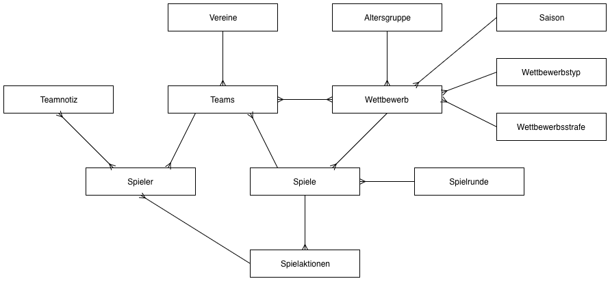
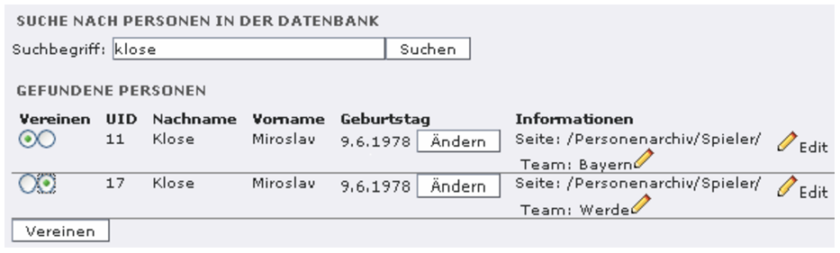
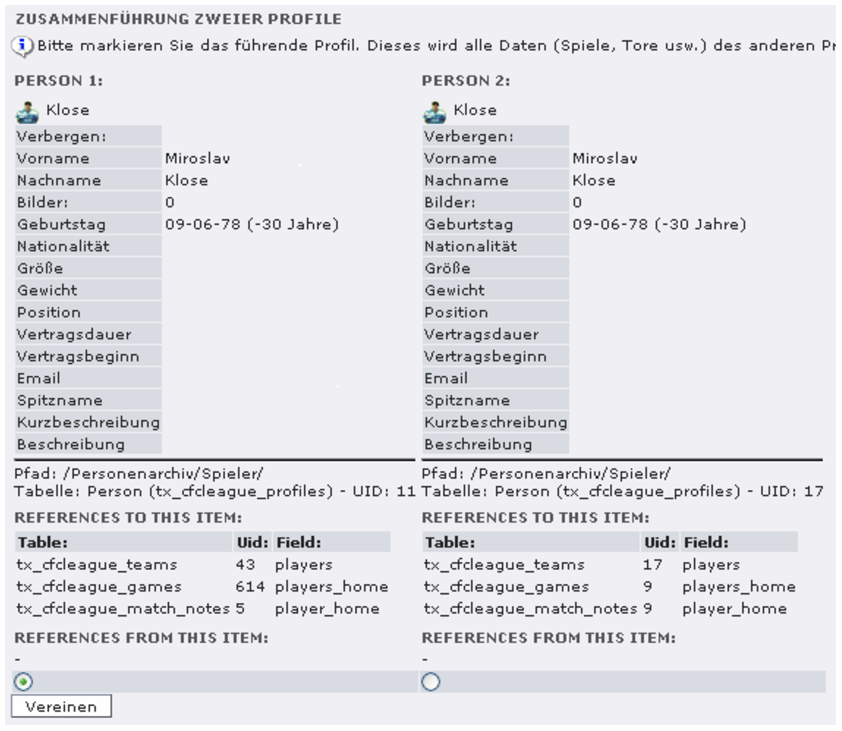
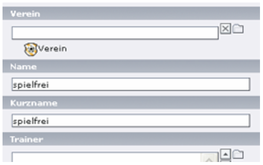
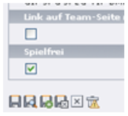

.. include:: ../Includes.txt

.. _for-editors:

===========
For Editors
===========

Zielgruppe: **Editoren**

Wie man die Extension aus der Persepktive eines Content-Editors verwendet.

.. _einleitung:

Einleitung
==========

Um die Extension sinnvoll einsetzen zu können, sollte man sich zunächst etwas mit dem zu Grunde liegenden Datenmodell vertraut machen. Dabei wird in diesem Dokument der Einfachheit halber, immer von der Verwaltung von Fußball-Ligen ausgegangen.

Wenn man Informationen über Fußballspiele sammelt, und diese dann in Relation zu einander führt, erhält man recht schnell ein doch recht komplexes Datenmodell. Denken wir nur daran, das Vereine über Jahre hinweg in verschiedenen Wettbewerben spielen, jedes Jahr neue Spieler rekrutieren und andere abgeben und natürlich auch in verschiedenen Altersgruppen mit Mannschaften antreten. Für jeden Wettbewerb existieren Spielpläne, die nach unterschiedlichen Regeln erzeugt werden müssen und wenn man letztendlich bei einem konkreten Spiel angekommen ist, setzt noch eine zusätzliche Datenflut ein. Da müssen die Aufstellungen der Teams, die Trainer und Schiedsrichter gesetzt werden. Neben den Ergebnissen wollen die gelben und roten Karten dokumentiert sein, ganz zu schweigen von Auswechslungen,Chancen, Eckbällen, Torschützen... Die Liste läßt sich sicher noch endlos fortführen. Aber bevor große Ängste, ob der notwendigen Arbeit aufkommen, die meisten dieser Daten können, müssen aber nicht gepflegt werden.

Die Aufgabe bei der Entwicklung bestand nun darin, ein Datenbankmodell zu entwickeln, das einerseits flexibel genug ist, all diese Daten aufzunehmen, welches andererseits aber nicht ins Uferlose ausarten sollte. Die folgende Grafik gibt einen Überblick über das so entstandene Modell. Bis auf Wettbewerbstyp und Spielrunde existiert für alle aufgeführten Entitäten eine entsprechende Tabelle in der Datenbank.

   Datenbankmodell von T3SPORTS

Die einzelnen Datenklassen sollen jetzt noch kurz vorgestellt werden.

.. _datenklassen:

Datenklassen
============

Saison
------

Da wir die Daten über längere Zeiträume hinweg erfassen und auswerten wollen, wird natürlich ein Datentyp für diesen zeitlichen Aspekt benötigt. Die Saison ist letztendlich aber nur eine Klammer über verschiedene Wettbewerbe die später für Ordnung bei Auswertungen aber auch den Dateneingaben sorgt.

Altersgruppe
------------

Auch die Altersgruppe wurde eingeführt, um zusätzliche Ordnung in die Daten zu bringen. Damit wird es möglich, daß ein Verein mit mehreren Teams in einer Spielzeit antreten kann. Dabei ist der Begriff “Altersgruppe” nur bedingt richtig, da beispielsweise auch Zweit- oder Drittmannschaften im Männerbereich als eigene Altersgruppe angelegt werden müssen. Selbiges gilt auch für den Spielbetrieb im Frauenbereich.

Verein und Team
---------------

Mit diesen beiden Datentypen wurde die folgende Annahme abgebildet: Jeder Verein stellt in jeder Saison ein oder mehrere neue Teams auf und läßt es in Wettbewerben antreten. Die Mannschaft ändert sich also jedes Jahr, der Verein bleibt aber der selbe. Daher nimmt der Verein quasi die Stammdaten auf, während das Team die variablen Daten abbildet. Es ist sehr wichtig, daß vor jeder neuen Saison neue Team-Datensätze angelegt werden. Dies soll das folgende Beispiel verdeutlichen:

*Im Team der Saison 2005/06 stehen 18 Spieler im Kader, darunter Heiner Hinkebein, der Topstürmer der Mannschaft. In der Saison 2006/07 wird Hinkebein an einen anderen Club verkauft. Der Liga-Administrator könnte jetzt auf die Idee kommen, sich Arbeit zu ersparen und in der neuen Saison einfach das schon vorhandene Team aus der Vorsaison zu verwenden und Hinkebein aus dem Kader zu löschen. Großer Fehler! Zwar würde beispielsweise im Frontend in der Teamübersicht für 2006/07 Hinkebein nicht mehr aufgeführt, allerdings wäre er nun auch 2005/06 nicht mehr zu sehen. Und das war definitiv nicht gewollt. Natürlich wäre er in den Jahr auch aus allen Statistiken entfernt worden, von den Inkonsistenzen in der Datenbank mal ganz zu schweigen.*

Daher: Sämtliche Teams müssen in jeder Saison neu angelegt werden! Einem Kopieren des Vorjahresteam steht natürlich nichts im Wege.

Eine Ausnahme gibt es noch für das Spezialteam “Spielfrei”. Es handelt sich dabei im einen normalen Team-Datensatz, bei dem jedoch das Attribut “spielfrei” markiert ist. Dieses Team wird verwendet, um spielfreie Spieltage für Teams zu kennzeichnen. Wenn eine Mannschaft ein Spiel gegen dieses Team bestreitet, dann hat es automatisch an diesem Spieltag frei. Dieses Spezialteam muss nur einmal angelegt werden und kann dann immer verwendet werden. Bei der Generierung einer Liga mit ungerader Mannschaftsanzahl, nimmt dieses Team den Platz des fehlenden Teams ein.

Wettbewerb und Wettbewerbstyp
-----------------------------

Jede Mannschaft tritt in einer Saison üblicherweise in verschiedenen Wettbewerben an. Da wären natürlich der normale Ligabetrieb, Pokalwettbewerbe oder auch Hallenturniere. Auch Freundschaftspiele kann man als eigenen “Wettbewerb” betrachten. Der Wettbewerbstyp **Liga** spielt eine besondere Rolle. Denn für eine Liga wird als Auswertung eine Tabelle benötigt. Auch können Tabellenfahrten oder Spielpläne erstellt werden, die in einem Pokalwettbewerb keinen Sinn ergeben. Der Wettbewerbstyp ist kein zusätzliches Datenobjekt, sondern lediglich ein Attribut im Datentyp **Wettbewerb**.

Profile
-------

Dieser Datentyp bildet Personen ab, die Einfluß auf den Spielbetrieb haben. Zuallererst seien hier natürlich die Spieler genannt, aber auch Trainer, Schiedsrichter oder Funktionäre können angelegt werden. All diese Personen werden im Datentyp “Profile” abgebildet. Wichtig werden dann die Zuordnungen, die wir für die angelegten Profile treffen. So müssen wir zunächst die angelegten Spieler- und Trainerprofile einem Team zu ordnen. Dieser Vorgang sollte zu Beginn einer Saison stattfinden. Wir stellen somit den eigentlichen Teamkader zusammen. Da diese Zuordnung recht aufwendig ist, bietet das Modul Ligamanagement die Funktion “Spieler anlegen” an. Mit dieser können sehr schnell die Profile erstellt und direkt einem Team zugeordnet werden.

Es ist sehr wichtig, daß jede Person nur einmal im System angelegt wird. Denn ein Spieler kann natürlich in verschiedenen Teams spielen. Er gehört jedes Jahr einem oder auch mehreren Teams an. Letzteres ist beispielsweise der Fall, wenn er in einer Saison Einsätze in der 1. und 2. Mannschaft eines Vereins hat. Nur wenn der Spieler einmal im System vorkommt, können sinnvolle statistische Auswertungen für diesen Spieler erstellt werden.

Spiele
------

Das eigentliche Herzstück der Ligaverwaltung sind natürlich die Spiele. Jeder Spieldatensatz ist genau einem Wettbewerb zugeordnet. Da wir im Wettbewerb schon die Teams festgelegt haben, können wir im Spieldatensatz nur noch zwischen den entsprechenden Teams wählen. Ein langes Suchen entfällt also. Trotzdem wäre die Spielplanerstellung für eine Liga natürlich sehr zeitraubend. Da der DFB bei der Erstellung der Spielpläne aber nach einem festen Schlüsselsystem vorgeht, kann dieser Schlüssel zur Erstellung des Spielplans genutzt werden. Der Schlüssel muss im Liga-Datensatz festgelegt werden. Wenn dann die Reihenfolge der Team richtig gesetzt ist, kann der gesamte Spielplan mit einem Mausklick erstellt werden.

In jedem Spiel müssen auch die Startformationen der Teams angegeben werden. Da wir bereits wissen, über welche Spieler die einzelnen Teams verfügen, bekommen wir in dem entsprechenden Formular direkt alle verfügbaren Spieler der Mannschaften angezeigt. Mit elf (bzw. 22) Mausklicks sind dann die Aufstellungen erledigt.

Zusätzlich ist natürlich noch Platz für einen Spielbericht und ein paar Bilder.

Spielnotizen
------------

Im Laufe eines Spiels passieren viele interessante Dinge. Es werden Tore geschossen, gelbe und rote Karten verteilt, Spieler ausgewechselt, Elfmeter verschossen, der Trainer auf die Tribüne verwiesen, die Werbebande fällt um.... Die Liste läßt sich je nach Geschmack beliebig fortsetzen. All diese Dinge sind aus zwei Gründen interessant: Erstens können wir sie nutzen, um einen Liveticker des Spiels zu zeigen. Zweitens können wir aber interessante Statistiken mit diesen Informationen erstellen. Wenn wir all diese Informationen auf einen gemeinsamen kleinsten Nenner bringen, dann erhalten wir den Datentyp “Spielnotiz”. Dieser enthält die Spielminute, eine Typ der Aktion, den beteiligten Spieler und einen Kommentar. Je nach Aktion müssen natürlich nicht alle Angaben gemacht werden. Pflichtfelder sind lediglich die Spielminute und der Typ.

Die Typen sind derzeit fest vorgeben, eine spätere Erweiterung ist aber nicht ausgeschlossen.

.. _datenstruktur:

Datenstruktur im Seitenbaum
===========================

Alle Datensätze können nur in SysFoldern angelegt werden. Um langfristig Ordnung zu halten, sollte man sich frühzeitig Gedanken über eine sinnvolle Seitenstruktur machen. Folgender Vorschlag kann dabei als Ausgangspunkt verwendet werden:

* Ligaverwaltung

	* Saison 2006/07

		* Männer
		* A-Jugend
		* B-Jugend

	* Saison 2005/06

		* Männer
		* A-Jugend

	* Vereine
	* Personenarchiv
	
		* eigener Spieler
	
			* Nachwuchs
			* andere Personen
			* Schiedsrichter
			
usw.

Natürlich spielt hier eine große Rolle, in welchem Umfang man die Daten pflegen möchte. Wer in erster Linie die Daten für seinen eigenen Verein sammelt, wird eine andere Struktur verwenden, als jemand der gleichermaßen über alle Vereine der Bundesliga berichten möchte.

Unterstützung für satzbasierte Sportarten
-----------------------------------------

Ursprünglich wurde T3sports für den Einsatz in Fußballvereinen entwickelt. Mit der Version 0.9.0 werden aber auch satzbasierte Sportarten wie Volleyball voll unterstützt. Beim Anlegen eines Wettbewerbs muss man dafür die gewünschte Sportart einstellen. In Abhängigkeit dieser Auswahl werden dann die vorhandenen Algorithmen bei der Berechnung der Tabelle angeboten. Außerdem ändert sich die Eingabemaske für die Spielergebnisse im BE-Modul. Die Satzergebnisse bei Volleyball können direkt mit eingegeben werden.

.. _wettbewerbe-verwalten:

Wettbewerbe verwalten
=====================

Funktion "Spiele bearbeiten"
----------------------------

Über diesen View kann man die Spiele von Wettbewerben bearbeiten. Es werden nur Spiele von Wettbewerben angezeigt, die sich auf der aktuell im Seitenbaum ausgewählten Seite befinden. Die Darstellung erfolgt gruppiert nach Spieltagen. So kann man schnell die wichtigsten Informationen eines Spieltags speichern. Man kann sich aber auch die Spiele über einen Vereinsspielplan anzeigen lassen.

Über diese Funktion hat man auch schnell Zugriff auf bestimmte Spiele oder Mannschaften, da alle Elemente auf der Seite mit einem Bearbeiten-Link ausgestattet sind.

Volleyball & Co.
~~~~~~~~~~~~~~~~

Wenn man einen Volleyball-Wettbewerb bearbeitet, dann muss man bei der Eingabe etwas aufpassen, damit später die Berechnung der Tabelle funktioniert. Man muss sowohl das Endergebnis des Spiels nach Sätzen als auch die Ergebnisse der einzelnen Sätze eingeben. Wenn also das Spiel 3:2 nach Sätzen endet, dann trägt man dieses Ergebnis als Endstand ein. Mit dieser Angabe ist die Berechnung der Tabelle grundsätzlich schon möglich. Wenn man aber auch die erzielten Punkte mit in der Tabelle anzeigen möchte, dann müssen natürlich auch die gesamten Satzergebnisse mit eingegeben werden. Da dafür nur ein einzelnes Eingabefeld vorhanden ist, muss bei der Eingabe das vorgegebene Format beachtet werden: 

**25:20;22:25;19:25;27:25;25:22**

Die Punkte im Satz werden also mit dem Doppelpunkt getrennt, die einzelnen Sätze mit einem Semikolon. Alternativ zum Semikolon kann man aber auch das Komma oder das Pipe-Symbol (|) verwenden. Die Eingabe hat aber nichts mit der Darstellung im Frontend zu tun. Diese kann man natürlich komplett frei bestimmen.

.. note::
	Es wird keine Validierung der Satzergebnisse mit dem Endstand durchgeführt. Wer falsche Daten eingibt wird als Ergebnis nur eine falsche Tabelle erhalten.

Funktion “Spielplan erstellen”
------------------------------

Ein Spielplan kann nur für Ligen erstellt werden. Dafür sind folgende Bedingungen notwendig:

* Der Liga dürfen noch keine Spiele zugeordnet sein
* Der Liga muss ein passender Spielplanschlüssel zugeordnet sein
* Der Liga muss die korrekte Anzahl Teams zugeordnet sein.

Die Beschreibung des Spielplanschlüssels kann man dem Tutorial entnehmen.

Sind alle Bedingungen erfüllt, wird der neue Spielplan zunächst angezeigt. Man hat nun die Möglichkeit das Datum und den Namen der einzelnen Spieltage anzupassen. Optional hat man auch die Möglichkeit zur die Hinrunde zu generieren. Dazu muss man einfach die Selectbox oben umstellen. (Achtung: bei einem Wechsel dieser Option gehen alle Daten verloren. Also zuerst anpassen!)

Wenn die Liga eine ungerade Anzahl von Mannschaften enthält, dann muß der freie Platz vom Spezialteam “spielfrei” belegt werden.

Die Generierung der Spiele erfolgt über den Button **"Erstellen"** am Ende der Seite. Alle Spiele werden im Seitenbaum auf der aktuell gewählten Seite angelegt.

.. _spielticker:

Spielticker / Spielstatistik
============================

Mit dieser Funktion kann zum einen ein Liveticker betrieben werden. Zum anderen werden die Information aber auch zur Berechnung von statistischen Daten (Arbeitsnachweis der Spieler) genutzt. Der Ticker kann nur sinnvoll betrieben werden, wenn vorher im Spiel die Aufstellungen der Teams festgelegt wurden.

Der Spieler “Unbekannt” kann verwendet werden, wenn bei einem Team die Aufstellung nicht bekannt ist, man aber beispielsweise trotzdem die Torfolge eingeben möchte.

Bei der Eingabe der Spielminute kann die Nachspielzeit einer Halbzeit gesondert angegeben werden. Fällt ein Tor in der 47. Spielminute der ersten Halbzeit, dann sollte man 45+2 angeben. Dadurch kann im Frontend die Aktion eindeutig der ersten Halbzeit zugeordnet werden.

.. _teams-verwalten:

Teams verwalten
===============

Spieler anlegen
---------------

Legt auf der aktuellen Seite die gewünschten Spieler und Trainer an. In der Konfiguration der Extension kann man einen bestimmten Root-SysFolder festlegen unterhalb dem alle Profile angelegt werden müssen. Diese Einschränkung wirkt sich aber nur auf diese Funktion auf. Über das List-Modul kann man auch in anderen SysFoldern noch Profile anlegen.

Spieler hinzufügen
------------------

Jede Person soll im System nur einmal angelegt werden. Daher muss ein Spieler, der in mehreren Teams vorhanden ist, bei allen weiteren Teams nur noch zugeordnet werden. Dazu gibt man hier einfach den Namen des Spielers ein und kann die gesamte Datenbank danach absuchen. Wird der gewünschte Spieler angezeigt, kann man ihn markieren und ins Team übernehmen.

Team-Notizen
------------

Mit dieser Funktion lassen sich recht einfach die Team-Notizen verwalten. Eine Team-Notiz wird verwendet, um einem Spieler Daten zu einem bestimmten Team zuzuordnen. Die Trikotnummer kann sich z.B. jedes Jahr ändern. Um diese Information trotzdem zu archivieren, werden Team-Notizen verwendet. Eine genauere Anleitung befindet sich in der Dokumentation von **T3sports FE**.

Damit dieses Modul verwendet werden kann, müssen zunächst über das Modul **Liste** die gewünschten **Notiz-Typen** angelegt werden. Am besten kommen sie in die Rootseite der Ligaverwaltung zu den **Saisons** und **Alterklassen**.

.. _personen-suchen:

Personen suchen
===============

Um zu verhindern, daß Personen doppelt angelegt werden, kann man mit dieser Funktion schnell nach Profilen in der Datenbank suchen. Die aktuelle Seite ist dabei bedeutungslos. Es wird immer die gesamte Datenbank durchsucht.

In der Ergebnisliste wird der gefundene Spieler, dessen Platz im Seitenbaum und die verknüpften Teams angezeigt. Zu den Datensätzen werden auch gleich die entsprechenden Buttons zur Bearbeitung angezeigt.

Geburtsdatum setzen
-------------------

Zusätzlich ist es möglich das Geburtsdatum einer Person zu ändern. Diese Funktion ist vor allem dann interessant, wenn die Person vor dem 1.1.1970 geboren wurde. Über die normalen Eingabefelder ist es in TYPO3 nicht möglich derartige Datumsangaben zu setzen. Diese Beschränkung gilt in diesem Eingabefeld nicht mehr.

Personen zusammenführen
-----------------------

Sollte es doch einmal vorgekommen sein, daß ein Spieler doppelt angelegt wurde, ist es ein recht aufwendiger Prozess diese beiden Spielerdatensätze wieder zu vereinen. Schließlich müssen auch alle Verweise auf die beiden Spieler auf eine der beiden Personen umgestellt werden. Dies betrifft Zuordnungen zu Teams, Spielen und natürlich auch Spielereignissen (gelbe/rote Karten, Ein-/Auswechslungen usw.). Über die Personensuche können diese Zuordnungen automatisch zusammengeführt werden.

**Schritt 1:** Einen passenden Suchbegriff eingeben, damit die beiden Spieler angezeigt werden.

   Passenden Suchbergiff eingeben, damit die Spieler gefunden werden, die zusammengeführt werden sollen.

Diese beiden Spieler können nun über die Radio-Buttons markiert werden. Der Klick auf den Button „Vereinen“ führt dann zu Schritt 2.

**Schritt 2:** Den „führenden“ Spieler auswählen.

Es wird nun festgelegt, welcher der beiden Spieler alle Referenzen übernehmen soll.

   Den führenden Spieler auswählen, auf dem die Daten zusammengeführt werden sollen.

Dies geschieht über den Radio-Button am Ende der Seite. Die Aktion wird über den Button „Vereinen“ angeschlossen.

Es gilt zu beachten, daß lediglich die Referenzen bei dieser Aktion verändert werden. Die Datensätze der Spieler werden nicht angetastet. Der doppelte Spieler wird also auch nicht gelöscht. Dies kann im Anschluss manuell erfolgen.

.. _sonstiges:

Sonstiges
=========

Umgang mit Vereinslogos
-----------------------

In T3sports gibt es verschiedene Möglichkeiten die Vereinswappen zu verwalten. Empfohlen wird das folgende Vorgehen: Man ordnet zunächst im Vereinsdatensatz eines oder mehrere Logos zu. Die mehreren Logos haben den Hintergrund, daß ja viele Vereine im Laufe der Zeit ihr Wappen geändert haben. Anschließend kann man in den Teams des Vereins das jeweils passende Logo in einer Auswahlbox festlegen. 

Wenn man nicht mit Vereinsdatensätzen arbeiten möchte, ist in den Teams die Zuordnung der Logos auch direkt möglich.

Spielfrei
---------

Wenn eine Liga aus einer ungeraden Anzahl von Mannschaften besteht, dann hat logischerweise an jedem Spieltag ein Team spielfrei. Seit der Version 0.2.0 wird dieser Umstand auch von der Ligaverwaltung aktiv unterstützt. Vom Prinzip her bestreitet eine Mannschaft die spielfrei hat eine Begegnung gegen ein **Spezialteam "Spielfrei"**. Diese Spiele werden also nicht einfach weggelassen, sondern es wird tatsächlich ein neuer Spieldatensatz angelegt. Dadurch wird es leichter, die spielfreie Mannschaft später im Frontend zu verarbeiten.

Ligaerstellung mit ungerader Teamanzahl
~~~~~~~~~~~~~~~~~~~~~~~~~~~~~~~~~~~~~~~

Bei der Erstellung der Liga mit dem Spielplanschlüssel des DFB wird einfach der nächsthöhere Schlüssel verwendet. Bei 11 Teams erfolgt die Erstellung also mit dem 12er Schlüssel. Der freie Platz muss nun allerdings mit einem zusätzlichen Team gefüllt werden.

Der erste Schritt ist also die Erstellung dieser neuen Mannschaft. Dies kann beispielsweise über das Modul Liste erfolgen. Es ist egal in welcher Seite dieser Datensatz angelegt wird. Da dieses Team nur ein Dummy-Datensatz ist, kann man es durchaus in verschiedene Wettbewerben wiederverwenden, auch in anderen Spielzeiten.

   Der Name des Teams sollte sinnvoll vergeben werden

   Nicht vergessen dieses Häkchen zu setzen!

Der Name des Teams ist frei wählbar. Er kann dann später bei Bedarf auch im Frontend ausgegeben werden. Ganz wichtig ist die Kennzeichnung der Mannschaft als spielfrei. Dafür gibt es ganz am Ende des Datenblatt ein entsprechendes neues Flag.

Wie im Tutorial beschrieben, kann man jetzt den neuen Spielplan erstellen. Das neue Team Spielfrei nimmt dabei den freien Platz ein.

In unteren Ligen gibt es auch die Situation, daß bei geringer Staffelbesetzung mehrere Teams an einem Spieltag spielfrei haben. Hier muss man zunächst anhand der Anzahl der Spieltage ermitteln, welcher Spielplanschlüssel verwendet wurde. Besteht die Staffel zum Beispiel aus 10 Teams und es sind aber 34 Spieltage angesetzt, dann wurde vermutlich ein 16er Schlüssel verwendet. In diesem Fall müssten 6 Spielfrei-Teams angelegt werden, um die freien Plätze zu besetzen.
