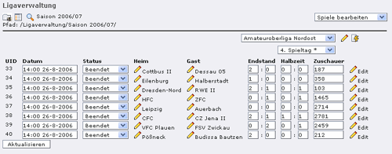
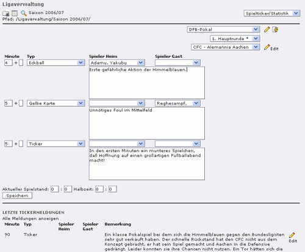
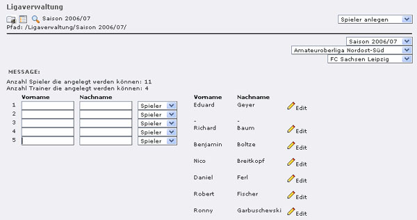
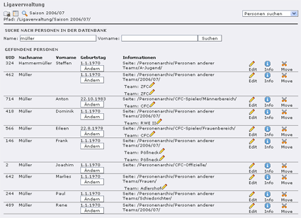

.. include:: ../Includes.txt

.. _introduction:

============
Introduction
============

.. _what-it-does:

What does it do?
================

Mit dieser Verwaltung können verschiedene Mannschaftssportarten, wie Fußball, Handball, Basketball oder Volleyball verwaltet werden. Dabei sind sowohl Ligabetrieb als auch Pokalwettbewerbe und Freundschaftspiele möglich. Die Daten können über mehrere Spielzeiten hinweg gepflegt und später ausgewertet werden. Die Spieler und Trainer der beteiligten Mannschaften können ebenso verwaltet werden, wie auch Spielberichte, Liveticker und statistische Daten.

Die Extension ist voll in TYPO3 integriert und nutzt sooft wie möglich die gewohnten Standardmasken. Zusätzlich steht für spezielle Aufgaben noch ein eigenes Backendmodul zur Verfügung.

Diese Extension verfügt ausschließlich über Backend-Funktionalität. Für die Darstellung im Frontend sei auf T3sports FE (cfc_league_fe) verwiesen. Tipp-Spiele können mit der Extension T3sports bet system (t3sportsbet) integriert werden. Für statistische Auswertungen kann die Extension Statistics for T3sports (t3sportstats) verwendet werden.

Die Erweiterung eignet sich sowohl für Vereinsseiten als auch für Onlinemedien. Erstellt wurde diese Extension für den `Chemnitzer FC <http://www.chemnitzerfc.de>`__ auf dessen Homepage sie auch im Einsatz ist.

Weitere Informationen befinden sich unter https://github.com/digedag/cfc_league

.. hint::
    Wenn Sie die Daten von T3sports oder die anderer TYPO3-Extensions 
    für mobile Anwendungenüber eine JSON Schnittstelle benötigen, dann 
    wenden Sie sich bitte an die Agentur das MedienKombinat GmbH 
    (kontakt@das-medienkombinat.de).

.. _sponsors:

Sponsors
========

Durch die freundliche Unterstützung von markt intern verlag GmbH kann T3sports seit der Version 0.8.0 optional auch ohne die Extension DAM verwendet werden.

.. _screenshots:

Screenshots
===========
Die nachfolgenden Screenshots zeigen einige Eingabemasken des Backendmoduls. Dieses Modul stellt derzeit die folgenden Funktionen zur Verfügung:

* Wettbewerbe verwalten (Ergebnisdienst, Teams zuordnen, Spielplanerstellung)
* Spielplanerstellung (nur für Ligabetrieb mit vorhandenem DFB-Schlüssel)
* Spielticker/Statistik
* Teams verwalten (Spieler anlegen bzw. zuordnen, Team-Notizen)
* Personen suchen

   Ergebnisverwaltung. Die wichtigsten Spieldaten können hier aktualisiert werden.

   Eingabemaske des Spieltickers. Bis zu drei Meldungen können parallel abgesetzt werden.

   Spieler anlegen. In dieser Maske werden Spieler anlegt und gleichzeitig dem eingestellten Team zugeordnet.

   Personen suchen: Man erhält einen schnellen Überblick über vorhandene Spieler.
