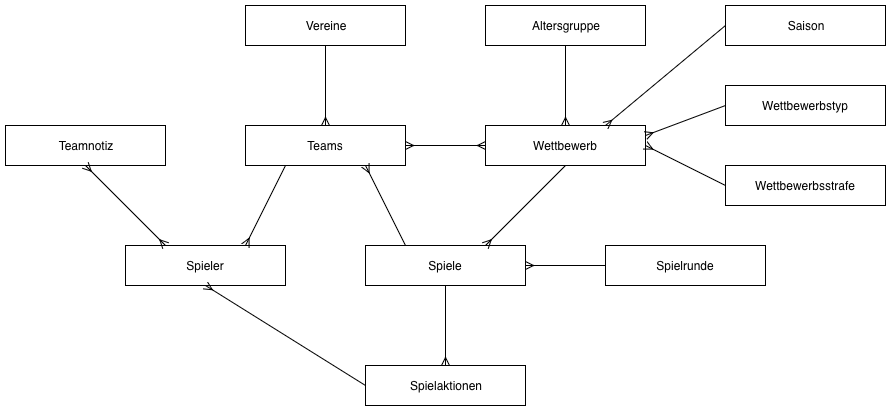

.. include:: ../Includes.txt

.. _tutorial:

========
Tutorial
========

In diesem Tutorial wird folgendes Szenario beschrieben: Wir haben die Homepage eines Fußballvereins, der mit seinen Mannschaften in verschiedenen Altersklassen am Spielbetrieb teilnimmt. Exemplarisch zeigen wir die Verwaltung der Männermannschaft und der A-Jugend. Dabei soll im Männerbereich der volle Funktionsumfang verwendet werden, während bei der A-Jugend nur die Ergebnisse und Tabellen interessieren.

Schritt 1: Saison und Altersgruppen
===================================

Der erste Schritt ist die Erstellung einer Seitenstruktur wie weiter oben (Anlegen der Datensätze im Seitenbaum von TYPO3) beschrieben. In der Seite **Ligaverwaltung** legen wir jetzt drei Datensätze an: 

Der erste Datensatz ist vom Typ **Saison**. Ein sinnvoller Name ist z.B. "Saison 2007/2008". Die beiden anderen Datensätze sind vom Typ **Altergruppe**. Sinnvolle Namen sind hier "1. Herrenmannschaft" und "A-Jugend". Im List-Modul sollte für die Seite anschließend die folgende Darstellung erscheinen:

   Datenbankmodell von T3SPORTS

Schritt 2: Mannschaften anlegen
===============================

Wir werden jetzt die ersten Teams anlegen. Entsprechend der beschriebenen Seitenstruktur geschieht dies in den SysFoldern **Teams Männer** und **Teams A-Jugend**. Über das List-Modul legen wir also in Seiten die in der jeweiligen Altersgruppe vertretenen Teams an. Das betrifft nicht nur das eigene Vereinsteam, sondern natürlich auch alle gegnerischen Mannschaften.

Die Seite für die A-Jugend könnte anschließend folgendes Aussehen haben: 

   Datenbankmodell von T3SPORTS

.. note::
    In diesem Schritt werden keine Vereine, sondern Mannschaften angelegt! Die Vereinszuordnung der Mannschaften wird vorerst noch nicht benötigt und kann daher frei bleiben.

